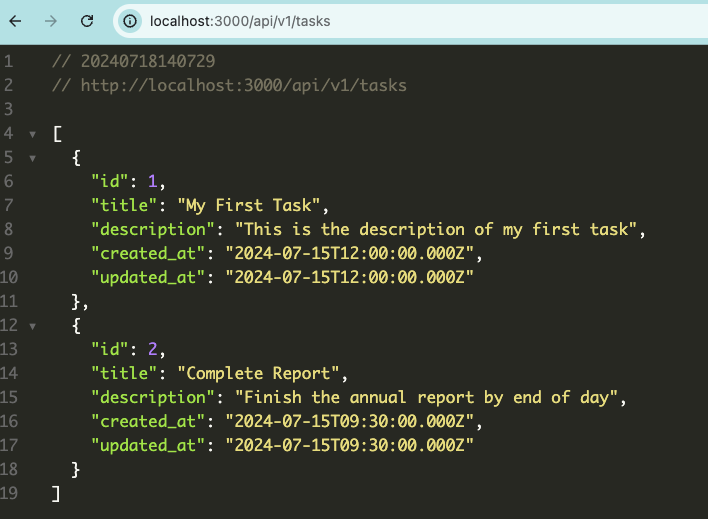
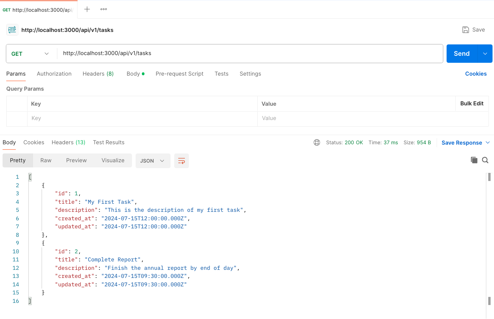
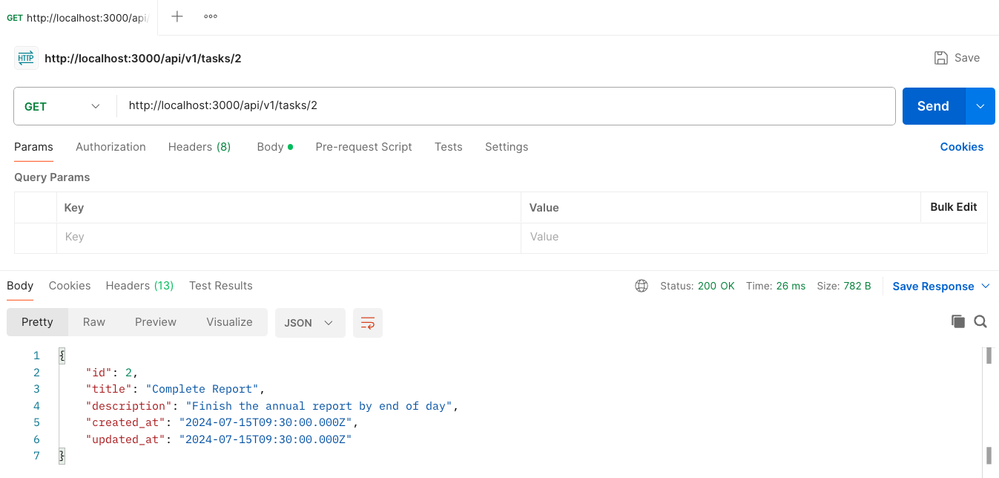
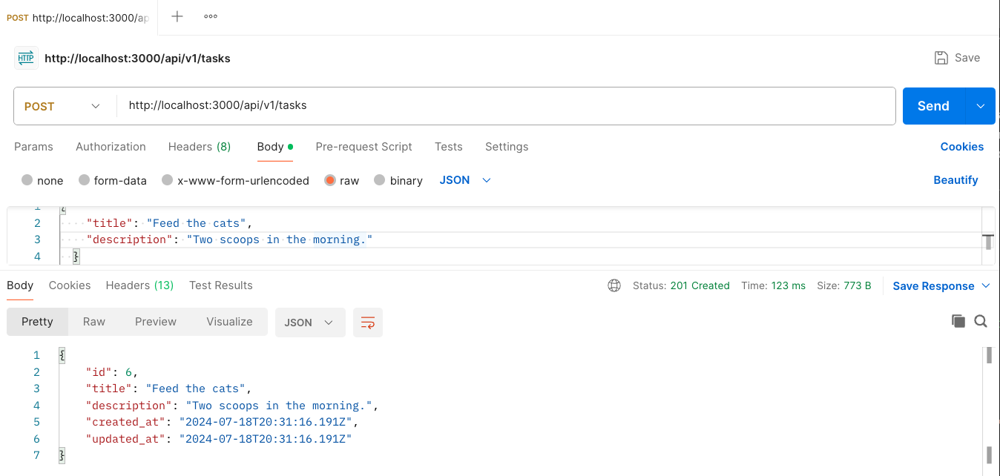

# Task Manager API

## CRUD in Rails

What does CRUD (in the the programming world) stand for?

- C: Create
- R: Read
- U: Update
- D: Delete

The apps that you will be creating in Mod 2 will make heavy use of these four actions.

Let's use Rails to build an application where we can manage some tasks.

We're going to follow the MVC design pattern, which Rails uses by default, to implement the CRUD actions for our Task Manager app. 

Here is a high level image of the MVC design pattern. You will learn in this [Intro to MVC](http://curriculum.turing.edu/module2/lessons/intro_to_mvc) lesson later in Mod 2.


In this tutorial we're building an API. APIs are used to provide data to an external system when they request it, and the the APIs we'll see will mostly serve up data in the form of JSON. JSON is a popular data format that looks like a Ruby hash.

Throughout the module, we'll talk through some conventions and best practices, but for now - we'd like for you to follow along with this tutorial. We highly recommend **not** copying and pasting the code in this tutorial. It's to your advantage to type each line of code on your own.

## Getting Configured

Before creating our new Task Manager app, let's make sure we are all on the same version of Rails. For this tutorial, you will want to be running Rails 7.1.2. To check which version of rails you have installed, run `$ rails -v`. If you see any version other than 7.1.2, you will need to follow [these instructions](./rails_uninstall.md) to get the correct version installed.

After confirming that you are running the correct version of rails, we are ready to get started!

To create your rails app, navigate to your 2module directory and run the following command:

`$ rails new task_manager -T -d="postgresql" --api`

Let's break down this command to better understand what is happening. `rails new` is the command to create a new Rails app - this will create *a lot* of directories and files; we will explore this file structure in a moment. `task_manager` is going to be the name of the directory in which our Rails app lives and is, essentially, the name of our application. `-T` tells Rails that we are not going to use its default testing suite. We will be using RSpec as our testing framework. `-d="postgresql"` tells Rails that we will be using a postgresql database; Rails can handle many different databases, but this is the one we will be using in Mod 2. `--api` tells rails that we want to build an API instead of an application that also has a frontend.

Now that we have created our rails app, let's `cd task_manager` and explore some of the structure that Rails builds out for us.

## Project Folder Structure


Taking a look at the files that rails creates can be a bit overwhelming at first, but don't worry - this tutorial will only touch on a handful of directories! The top level directories that we are concered with are:

- *app* - This is where we configure Models and Controllers.
- *config* - Inside this directory, in the routes.rb file is where we will tell our Rails app which HTTP requests to respond to.
- *db* - Where our database structure will be set up.

In addition to these directories, we will also be dealing with our Gemfile, which is where we will tell Rails about any other gems we might need to run our app. For our task manager we will be adding just one gem to our Gemfile. Open your gemfile and add `pry` to the `:development, :test` group - your Gemfile should now look like this:

```ruby
source "http://rubygems.org"
git_source(:github) { |repo| "http://github.com/#{repo}.git" }

ruby "3.2.2"

# Bundle edge Rails instead: gem "rails", github: "rails/rails", branch: "main"
gem "rails", "~> 7.1.2"

# The original asset pipeline for Rails [http://github.com/rails/sprockets-rails]
gem "sprockets-rails"

# Use postgresql as the database for Active Record
gem "pg", "~> 1.1"

# Use the Puma web server [http://github.com/puma/puma]
gem "puma", "~> 6.0"

# Use JavaScript with ESM import maps [http://github.com/rails/importmap-rails]
gem "importmap-rails"

# Hotwire's SPA-like page accelerator [http://turbo.hotwired.dev]
gem "turbo-rails"

# Hotwire's modest JavaScript framework [http://stimulus.hotwired.dev]
gem "stimulus-rails"

# Build JSON APIs with ease [http://github.com/rails/jbuilder]
gem "jbuilder"

# Use Redis adapter to run Action Cable in production
# gem "redis", "~> 4.0"

# Use Kredis to get higher-level data types in Redis [http://github.com/rails/kredis]
# gem "kredis"

# Use Active Model has_secure_password [http://guides.rubyonrails.org/active_model_basics.html#securepassword]
# gem "bcrypt", "~> 3.1.7"

# Windows does not include zoneinfo files, so bundle the tzinfo-data gem
gem "tzinfo-data", platforms: %i[ mingw mswin x64_mingw jruby ]

# Reduces boot times through caching; required in config/boot.rb
gem "bootsnap", require: false

# Use Sass to process CSS
# gem "sassc-rails"

# Use Active Storage variants [http://guides.rubyonrails.org/active_storage_overview.html#transforming-images]
# gem "image_processing", "~> 1.2"

group :development, :test do
  # See http://guides.rubyonrails.org/debugging_rails_applications.html#debugging-with-the-debug-gem
  gem "debug", platforms: %i[ mri mingw x64_mingw ]
  gem "pry"
end

group :development do
  # Use console on exceptions pages [http://github.com/rails/web-console]
  gem "web-console"

  # Add speed badges [http://github.com/MiniProfiler/rack-mini-profiler]
  # gem "rack-mini-profiler"

  # Speed up commands on slow machines / big apps [http://github.com/rails/spring]
  # gem "spring"
end
```

Any time we update our Gemfile, we will need to tell our application to install or update the additional gems. In your terminal, run the command:

```bash
$ bundle install
```

Great - now we can use `binding.pry` anywhere in our app to debug as we go!

## Database Set-Up

Before we can see what our new rails app can do, we need to do some more set up. First, let's create our app's database. Do this from the command line with:

```bash
$ rails db:create
```

You should see some output like this:

```bash
Created database 'task_manager_development'
Created database 'task_manager_test'
```

We have created two databases, a "development" and a "test" database. In this tutorial, we won't be writing any tests so we won't touch our test database. We are working in the "development" environment.

Great, now our database is created! But, we don't have any tables yet.

### Migrating to our Database

We could potentially create a tasks table directly from our terminal, but that's no fun, and it makes it pretty difficult to work with other people. Instead, let's create some migrations.

Migrations allow you to evolve your database structure over time. Each migration includes instructions to make some change to the database (e.g. adding a table, adding columns to a table, dropping a table, etc.). One advantage to this approach is that it will allow you to transfer the application to different computers without transferring the whole database. This isn't a big problem for us now, but as your database grows it will be advantageous to be able to transfer the instructions to create the database instead of the database itself.

To create a migration that will send instructions to create a tasks table to our database, run the following command from your terminal:

```bash
$ rails generate migration CreateTask title:string description:string
```

In this command, we are telling rails to generate a migration file that will create a tasks table in our database with two columns - title and description. To see the migration that rails created, open your `db/migrate` directory, and you should have a file in there that is called something like `db/migrate/20190414173402_create_task.rb`. Open that file and you will see the following:

```ruby
class CreateTask < ActiveRecord::Migration[7.0]
  def change
    create_table :tasks do |t|
      t.string :title
      t.string :description

      t.timestamps
    end
  end
end
```

So, now we have a migration with some instructions to tell our database to create a tasks table, but how do we actually get the table created? Run the following in your terminal:

```bash
$ rails db:migrate
```

And you should see something like this:

```bash
== 20221130062449 CreateTask: migrating =======================================
-- create_table(:tasks)
   -> 0.0052s
== 20221130062449 CreateTask: migrated (0.0053s) ==============================
```

Great! How can we verify that worked?

In your terminal, connect to the database that we just created, and see if we can select some information from our tasks table:

```bash
$ rails dbconsole
```

```bash
psql (14.2)
Type "help" for help.

task_manager_development=# SELECT * FROM tasks;
 id | title | description | created_at | updated_at
----+-------+-------------+------------+------------
(0 rows)

task_manager_development=#
```

Awesome - we have a database with a table for tasks! In order to test your API, you'll want to add at least two tasks to your database. Review your SQL practice from intermission to learn how to add some tasks. 

If you're still stuck, this is a great time to use ChatGPT to help you generate some data. Try asking something like 
```
How can I write SQL to insert data into this table?

id | title | description | created_at | updated_at
```

To exit the psql session, enter the command `exit`

## Getting the App Running

Now that we've set up our database, it's time to get our server up and running and ready for HTTP requests. To do this, run either

`rails server` or `rails s`

You should see something like this:

```bash
=> Booting Puma
=> Rails 7.1.2 application starting in development
=> Run `bin/rails server --help` for more startup options
Puma starting in single mode...
* Puma version: 5.6.5 (ruby 3.2.2-p18) ("Birdie's Version")
*  Min threads: 5
*  Max threads: 5
*  Environment: development
*          PID: 66200
* Listening on http://127.0.0.1:3000
* Listening on http://[::1]:3000
Use Ctrl-C to stop
```

Navigate to [http://localhost:3000/](http://localhost:3000/) and you should see some Rails magic!

Now, let's take a look back at your terminal and walk through what just happened.

```bash
Started GET "/" for ::1 at 2022-11-29 18:51:51 -0700
Processing by Rails::WelcomeController#index as HTML
  Rendering /Users/mdao/.rbenv/versions/3.2.2/lib/ruby/gems/3.1.0/gems/railties-7.0.5/lib/rails/templates/rails/welcome/index.html.erb
  Rendered /Users/mdao/.rbenv/versions/3.2.2/lib/ruby/gems/3.1.0/gems/railties-7.0.5/lib/rails/templates/rails/welcome/index.html.erb (Duration: 1.4ms | Allocations: 635)
Completed 200 OK in 13ms (Views: 4.9ms | ActiveRecord: 0.0ms | Allocations: 5094)
```

On the first line, you are seeing a snapshot of the HTTP request that was received by our server when we navigated to localhost:3000 - `GET "/"`. This is basically telling us that our application received a request for the information that lives at a certain address.

On the last line, we can see a snapshot of the response that our server sent back to the browser `Completed 200 OK`. Meaning, we received a request, were able to process that request and succesfully send back a response. The response is what contains the information that allows the browser to render the default page for your Rails app!

## Returning All Tasks

### Adding the Route

Let's update our app to return something other than the default Rails welcome page - remember our goal is to send back JSON data that a frontend application could use.

Here's our goal. When our browser makes a GET request to `localhost:3000/api/v1/tasks`, we want our API to return all of the tasks currently in the database. You'll notice that all of our endpoints start with the namespace `api` and the version `v1`. You will learn more about namespaces and versions later in this Mod.

We want to see something like this:


Try navigating to `localhost:3000/api/v1/tasks` in your own browser. You should see an error telling you that `No route matches [GET] "/api/v1/tasks"`. Our app received a request that it was not set up to handle, so let's change that!

First we need to update our `config/routes.rb` to handle a `GET '/api/v1/tasks'` request. Update your routes.rb file to include the following:

**config/routes.rb**

```ruby
Rails.application.routes.draw do
  # Define your application routes per the DSL in http://guides.rubyonrails.org/routing.html

  # Defines the root path route ("/")
  # root "articles#index"

  get "/api/v1/tasks", to: "api/v1/tasks#index"
end
```

This line that we added is telling our application that anytime we receive an HTTP GET request for the URI '/api/v1/tasks', we should perform the index action within our tasks controller.

Go back to your browser and refresh the page - you should now be seeing an error telling you that you have a `Routing Error`; specifically, that you have an `uninitialized constant Api::V1::TasksController`. This is a good thing; at this point, we have told our application which controller action to perform when this request is received, but we haven't created that controller (or the action) yet. So, let's go do that.

### Adding the Controller

Run the following commands in your terminal to create your file `tasks_controller.rb` nested inside `app/controllers/api/v1`.

```
$ mkdir -p app/controllers/api/v1
$ touch app/controllers/api/v1/tasks_controller.rb
```

**app/controllers/api/v1/tasks_controller.rb**

```ruby
class Api::V1::TasksController < ApplicationController
  def index
    render json: {
      example_key: {
        example_nested_key: "It worked!"
      },
      example_array_key: [
        "Array item 1", "Array item 2"
      ]
    }
  end
end
```

Go back to your browser and refresh the page. You should now see the json data you added show up in your browser! Does this remind you of anything? (hint: Nested collections in Mod 1)

Try changing the keys and values of the data that's returned.

We're getting close! The last thing we need to do is return the tasks stored in our database instead of this random json. Following MVC conventions, we're going to create a Model to help us do this.

### Creating our Model

In order to follow MVC conventions, we are going to create this Task class in a `app/models/task.rb` file. In that file, create a Task class that looks like this:

**app/models/task.rb**

```ruby
class Task < ApplicationRecord

end
```

Why inherit from `ApplicationRecord`? This Task class that we are creating is meant to be a very specific and specialized class that we refer to as a Model. The purpose of Models is to create objects based on records that exist in a database. Rails give us some methods that we can use to help in this creation and we inherit those methods from `ApplicationRecord`. Some of the methods that we inherit are `all`, `find` and `create`. These methods are inherited even when our class is totally empty. We're going to make use of the `all` method first.

### Returning Tasks from the Database

Update your tasks_controller to match the following. Rails will pull all of the Tasks from our database and then `render json:` will return that data as json.

**app/controllers/api/v1/tasks_controller.rb**

```ruby
class Api::V1::TasksController < ApplicationController
  def index
    render json: Task.all
  end
end
```

Refresh your browser and you should now see when you make a request to http://localhost:3000/api/v1/tasks you are returned all of the tasks as json. Success!

## Returning One Task

The next endpoint we need to create is a `GET` request to http://localhost:3000/api/v1/tasks/:id, which should return the task with the ID specified. For example, a `GET` request to http://localhost:3000/api/v1/tasks/2` would return the task with id 2.

If you make the request http://localhost:3000/api/v1/tasks/2 in your browser. You should see the error `No route matches [GET] "/api/v1/tasks/2"`. This is because we haven't added this route. Update your routes.rb file to include the following:

**config/routes.rb**

```ruby
Rails.application.routes.draw do
  # Define your application routes per the DSL in http://guides.rubyonrails.org/routing.html

  # Defines the root path route ("/")
  # root "articles#index"

  get "/api/v1/tasks", to: "api/v1/tasks#index"
  get "/api/v1/tasks/:id", to: "api/v1/tasks#show"
end
```

Now let's add that show route into our tasks_controller:

**app/controllers/api/v1/tasks_controller.rb**

```ruby
class Api::V1::TasksController < ApplicationController
  def index
    render json: Task.all
  end

  def show

  end
end
```

Remember when we talked about how we are inheriting some functionality from ActiveRecord that helps us interact with our database? Well, now's a great place to take advantage of the ActiveRecord method find, which will retrieve a record from our database based on that record's id. In this case, we can use find like this:

**app/controllers/api/v1/tasks_controller.rb**

```ruby
def show
  render json: Task.find(params[:id])
end
```

Navigate to https://localhost:3000/api/v1/tasks/1 and you should now see the json for that particular task!

What is this `params` that we are passing into the find method? Let's throw a binding.pry at the top of our show action and see what we can find:

```ruby
def show
  binding.pry
  render json: Task.find(params[:id])
end
```

Refresh your browser and take a look at your terminal. In your pry session, call params and see what is returned.

```
 13: def show
 => 14:   binding.pry
    15:   render json: Task.find(params[:id])
    16: end

[1] pry(#<TasksController>)> params
=> #<ActionController::Parameters {"controller"=>"tasks", "action"=>"show", "id"=>"2"} permitted: false>
```

We are getting a params object that includes an :id that matches with the very end of the uri we visited (/api/v1/tasks/2). Looking at our routes, we see that we set up our URI pattern to accept :id, but when we visited this site, we typed in 2 which is an actual id that exists in our database. When we need to get some information, like an id, from our route in the form of parameters, we can include a symbol of the thing we are expecting when we set up our route - in this case, we are expecting an :id. So, based on how we set up our routes, we can manipulate and dictate what parameters we want; and what information we will need access to in our controllers.

Remember that you will need to exit your pry session to continue interacting with your site!

## Requests in Postman

Open up [Postman](http://www.postman.com/downloads/) which you should have installed over intermission.

In postman, make the same two requests you have been making in your browser.

GET /localhost:3000/api/v1/tasks



GET /localhost:3000/api/v1/tasks/2


While you can make GET requests in your browser, it's often easier to see what's happening in Postman. 

Additionally, we're now going to build POST, PUT and DELETE endpoints and we need an additional tool such as Postman to make those types of requests.

## Adding New Tasks

Our goal is to support all of the CRUD operations in our API. We have successfully build out the Read portion, now it's time to build a route for Creating a new task.

Let's set up the request in Postman first. To create a new task, you're making a `POST` request to the `/api/v1/tasks` endpoint and passing in the data for that new task in your request body. Notice how we change the request type to `POST` in the top left and how we are now including a request body.



To build out this endpoint, we will follow the same steps as we have been. 1. Add the route. 2. Update the controller.

**config/routes.rb**

```ruby
Rails.application.routes.draw do
  # Define your application routes per the DSL in http://guides.rubyonrails.org/routing.html

  # Defines the root path route ("/")
  # root "articles#index"

  get "/api/v1/tasks", to: "api/v1/tasks#index"
  get "/api/v1/tasks/:id", to: "api/v1/tasks#show"
  post "/api/v1/tasks", to: "api/v1/tasks#create"
end
```

And then in our tasks controller:

**app/controllers/api/v1/tasks_controller.rb**

```ruby
class Api::V1::TasksController < ApplicationController
  def index
    render json: Task.All
  end

  def show
    render json: Task.find(params[:id])
  end

  def create
    render json: Task.create(task_params)
  end

  private

  def task_params
    params.require(:task).permit(:title, :description)
  end
end
```

Now that we have our create endpoint set up, let's put a binding.pry in our tasks controller's create action so that it looks like this:

**app/controllers/api/v1/tasks_controller.rb**

```ruby
def create
  binding.pry
  render json: Task.create(task_params)
end
```
Make a POST request to http://localhost:3000/api/v1/tasks in Postman. In our terminal, we should have hit our pry - let's make sure we have access to the information we need to create a new task:

```
From: /Users/zoepeterson/turing/task_manager/app/controllers/api/v1/tasks_controller.rb:12 Api::V1::TasksController#create:

    11: def create
 => 12:   binding.pry
    13:   render json: Task.create(task_params)
    14: end

[1] pry(#<Api::V1::TasksController>)> params
=> #<ActionController::Parameters {"title"=>"Feed the cats", "description"=>"Two scoops in the morning.", "controller"=>"api/v1/tasks", "action"=>"create", "task"=>{"title"=>"Feed the cats", "description"=>"Two scoops in the morning."}} permitted: false>
```
Looks good! We have access to the parameters we need. Notice that we have also added the following private method.

```ruby
private

def task_params
  params.require(:task).permit(:title, :description)
end
```

This is making use of a Rails feature called strong parameters. Strong params ensures that only permitted parameters are used to create or update an object, which helps to protect your application from malicious users who might try to update attributes that they shouldn't have access to. It also allows us to require certain attributes. 

To see this validation in action, try making a request that doesn't include a request body. Your API should return an error message saying `"#<ActionController::ParameterMissing: param is missing or the value is empty: task>",` with the error status code `400`.

You will learn more about strong params later in this Mod.

## Editing a Task

At this point, we have an API that will allow us to fetch a list of tasks, fetch a specific task, and add a task. We have covered the Create and Read portions of CRUD. Now, let's add some functionality to be able to Update existing tasks.

We want to support a PATCH request to `/api/v1/tasks/:id` where the user sends the fields to update in the request body.

### Creating the Route and Controller Action 

In our `config/routes.rb` file, add the following route:

**config/routes.rb**

```ruby
patch '/api/v1/tasks/:id', to: "api/v1/tasks#update"
```

And in our tasks controller, add the following action:

**app/controllers/api/v1/tasks_controller.rb**
```ruby
def update
  render json: Task.update(params[:id], task_params)
end
```

We're making use of the same task_params method as before for validation. And we're making use of the ActiveRecord's `update` method to update the object that corresponds with the id provided in the path.

Now that we have this edit functionality implemented, make sure you have your server running, and play around with sending requests in Postman to update tasks.

## Deleting a Task

As of now, we have the Create, Read, and Update functions done - all we are missing is Delete!

### Add a Delete Route and Controller Action

Let's go add that route to our `config/routes.rb`:

**config/routes.rb**
```ruby
delete '/api/v1/tasks/:id', to: "api/v1/tasks#destroy"
```

And, with this route, we will need to add a destroy action to our tasks controller:

```ruby
def destroy
  render json: Task.delete(params[:id])
end
```

Another new method! We have used find, create, and update so far - what is delete doing? delete is another method we are inheriting from ActiveRecord that deletes records in our database based on an id that you send to the method.

Now, we should be able to send a `DELETE` request to http://localhost:3000/api/v1/tasks/:id and delete the task for the provided id!

Try making a `DELETE` request and then making a `GET` request using the same id. You should get an error message similar to `"#<ActiveRecord::RecordNotFound: Couldn't find Task with 'id'=6>",` and the status code `404`.

### One Step Further - Serializers

The goal for this tutorial is to walk you through the full process of building an API that supports the fully CRUD actions. We have successfully done that and we could stop here!

But often times we will want to customize our response a little bit more instead of sending back the full object. For us to accomplish this, we are going to use something called a Serializer.

```
$ mkdir -p app/serializers
$ touch app/serializers/task_serializer.rb
```

Let's imagine that our frontend doesn't care about the `created_at` and `updated_at` timestamps. We want to store those in our database for tracking purposes, but we don't want to send them to the frontend.

Add the following serializer which only includes the fields `id`, `title`, and `description`.

**app/serializers/task_serializer.rb**

```ruby
class TaskSerializer
  def self.format_tasks(tasks)
    tasks.map do |task|
      {
        id: task.id,
        title: task.title,
        description: task.description
      }
    end
  end
end
```

Now that we have a serializer that formats our tasks for our json response we can use it in our controller.

**app/controllers/api/v1/tasks_controller.rb**

```ruby
def index
  tasks = Task.all
  render json: TaskSerializer.format_tasks(tasks)
end
```
Make a GET request to retrieve all tasks again and we should see the new formatting! If you are curious to learn more about serializers, look ahead to the serializers lesson and do a little research.

## Finished!

Congrats! You have finished your first Rails API that can handle full CRUD functionality for a database resource! We can now Create, Read, Update, and Delete tasks! And you are now familiar with the concept of a serializer to customize how your format your Json response.

## Checks for Understanding

TESTING 123. TESTING AGAIN
1. Define CRUD.
1. Define MVC.
1. What two files would you need to create/modify for a Rails application to respond to a GET request to /api/v1/tasks, assuming you have a Task model.
1. What are params? Where do they come from?
1. What is the purpose of a serializer?
